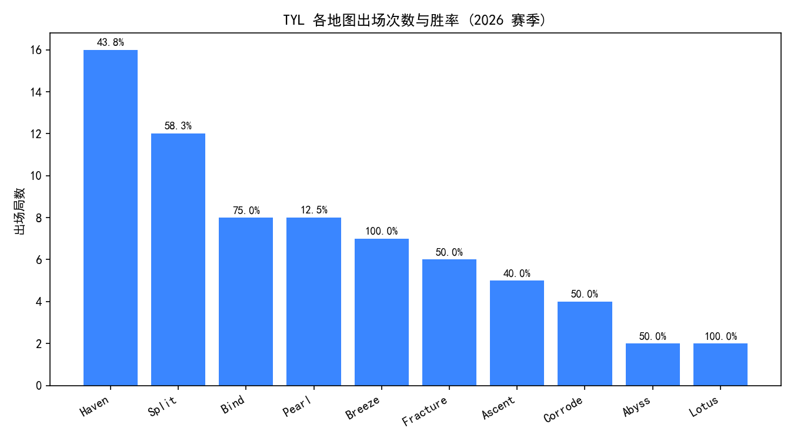
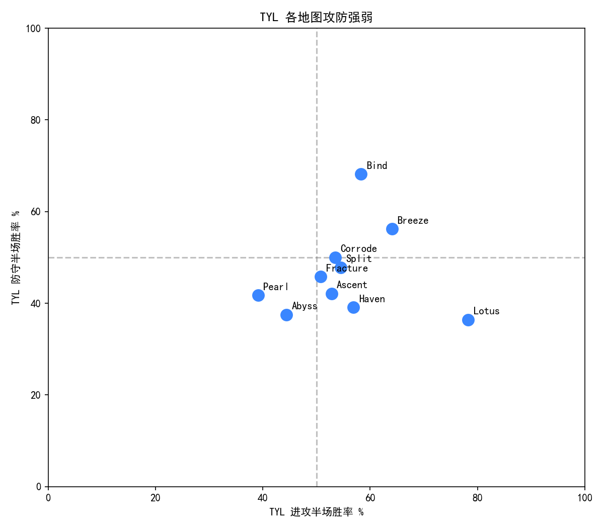
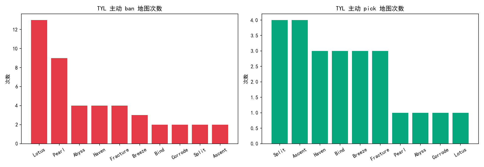

# VCT TYL Scouting Report

> 针对 TYL (TYLOO) 2026 赛季的对手情报分析项目 —— 以 FPX 视角拆解其 BP、阵容、攻防与节奏,产出可执行的赛前情报报告。

## 项目背景

TYL 是 FPX 在 2026 VCT CN 启点赛首轮的实际对手。本项目站在 FPX 数据分析师的视角,通过抓取 TYL 2026 赛季的全部职业对局数据,量化其战术特征,并落到针对性的 BP 建议与反制策略 —— 模拟数据分析师在面对一支具体对手时的真实备战工作流。

## 关键发现

基于 26 个 BO、约 1100 个回合的数据,几个最硬的洞察:

- **BP 资源不够补的死穴。** TYL 全赛季主动 ban 掉 Lotus 13 次、Pearl 9 次,但 BO3 只有四个 ban 名额,Pearl 还是被对手反复送上来 8 次,胜率仅 **12.5%** —— 是一个被对手摸透的漏洞。
- **Bind 才是真本命。** 防守半场胜率 **68%**,是所有地图里最高的;主动 pick 却只有 3 次,容易被对手忽略而陷入这张图。
- **Haven 是出场最多但守不住的"决胜图陷阱"。** 出场 16 次最高,胜率却只有 **43.8%**,防守半场仅 **39%**,FPX 若拿到 Haven 选边权应坚决选进攻。
- **体系偏进攻型,核心吃个人发挥。** 整体进攻胜率 55.2%、防守 48.0%,反 CN 赛区"偏架枪"传统印象;Yoru 异常高使用率(19 次,排名第 5)指向核心 duelist 个人能力依赖。

### 几张关键图

**TYL 各地图出场与胜率** —— Pearl(12.5%)、Haven(43.8%)是漏洞,Bind(75%)、Breeze(100%)是本命:



**TYL 各地图攻防强弱** —— Bind 防守 68% 全图最高;Haven 攻 57 防 39 是典型"决胜图陷阱";Pearl 攻防双弱:



**TYL 主动 ban / pick 倾向** —— Lotus 主动 ban 13 次、Pearl 9 次,BP 习惯极其鲜明,但 ban 位不够补 Pearl 的漏洞:



完整结论与 BP 建议见 [`TYL_Scouting_Report.pdf`](TYL_Scouting_Report.pdf) 或 [`analysis.ipynb`](analysis.ipynb) 第 7 节。

## 数据与方法

- **数据来源:** VLR.gg,经社区库 [vlrdevapi](https://pypi.org/project/vlrdevapi/) 抓取。VLR 无官方 API,vlrdevapi 为非官方爬虫封装,字段名以实测为准。
- **样本范围:** TYL 2026 赛季全部已完成对局,共 26 个 BO、48 局地图、约 1100 个回合,覆盖 VCT CN 启点赛、第一赛段、China Evolution Series、EWC China Qualifier 等阶段。
- **技术栈:** Python 3.12、vlrdevapi、Pandas、Matplotlib、Jupyter。
- **分析维度:** 地图池与 BP 倾向、特工与阵容选择、攻防半场强弱、对局节奏、手枪局表现,共 5 个维度、6 张图表。

## 项目结构

```
vct-tyl-scouting-report/
├── scrape.py                  # 数据抓取脚本,跑一次,把原始数据存到 data/raw/
├── analysis.ipynb             # 主分析 Notebook,读本地数据,不联网,可一键复现
├── TYL_Scouting_Report.pdf    # 由 Notebook 导出的图文报告
├── figures/                   # 6 张分析图表
├── data/                      # raw/ 抓取产物;clean/ 清洗后的 4 张数据表
├── requirements.txt
├── README.md
├── LICENSE
└── .gitignore
```

抓取与分析分离 —— `scrape.py` 负责一次性数据采集,`analysis.ipynb` 负责可复现的分析。两者解耦的好处:改清洗逻辑不必重新抓数据;VLR 改版导致抓取失效时,已存的本地数据依然可用。

## 如何复现

```bash
pip install -r requirements.txt

# 1. 抓数据(需联网,跑一次即可。脚本带断点续抓与限速)
python scrape.py

# 2. 打开分析 Notebook
jupyter notebook analysis.ipynb
```

`analysis.ipynb` 每个维度为"说明 → 出图 → 解读"结构,通读即是完整报告。
导出 PDF:`jupyter nbconvert --to pdf analysis.ipynb`(或先 `--to html` 再浏览器打印)。

## 开发过程笔记

实际过程中遇到并处理的几个问题,留作参考:

- **vlrdevapi 字段名以实测为准。** 初版脚本基于文档假设字段名为 `event`,实测发现真实字段为 `tournament_name` 和 `match_datetime`;同时 `tournament_name` 命名不统一(有 "VCT 2026"、"CN EVO 26" 等多种格式),最终改为按 `match_datetime.year` 过滤赛季,更可靠。
- **抓取中断与断点续抓。** vlrdevapi 是非官方爬虫封装,依赖 VLR 页面结构,网络波动下偶有失败。脚本里加了:每个 series 抓完立即落地存盘、已存在则跳过、单请求失败重试 3 次、全程限速 —— 中断后只需重跑,不会丢已抓数据。
- **首杀数据不可得。** vlrdevapi 返回字段中 fk / fd / adr / kast 等细颗粒度数据为 null,因此原计划的"首杀转化率"维度改为"手枪局胜率",数据稳定可靠。

## 局限说明

- 样本限于 2026 赛季已完成的 26 个 BO;部分地图(Lotus、Abyss)样本仅 2 局,相关结论保守处理。
- TYL 阵容/选手在赛季中可能调整,以最新阵容信息为准。
- 首杀、ADR、KAST 等细颗粒度数据不可得;若数据源升级,可加入"首杀转化率"等更深维度。

## 关于本项目

本项目作为个人能力展示,用于 FPX 无畏契约分部数据分析师岗位投递。与 VLR.gg、Riot Games 无关联。

License: [MIT](LICENSE)
